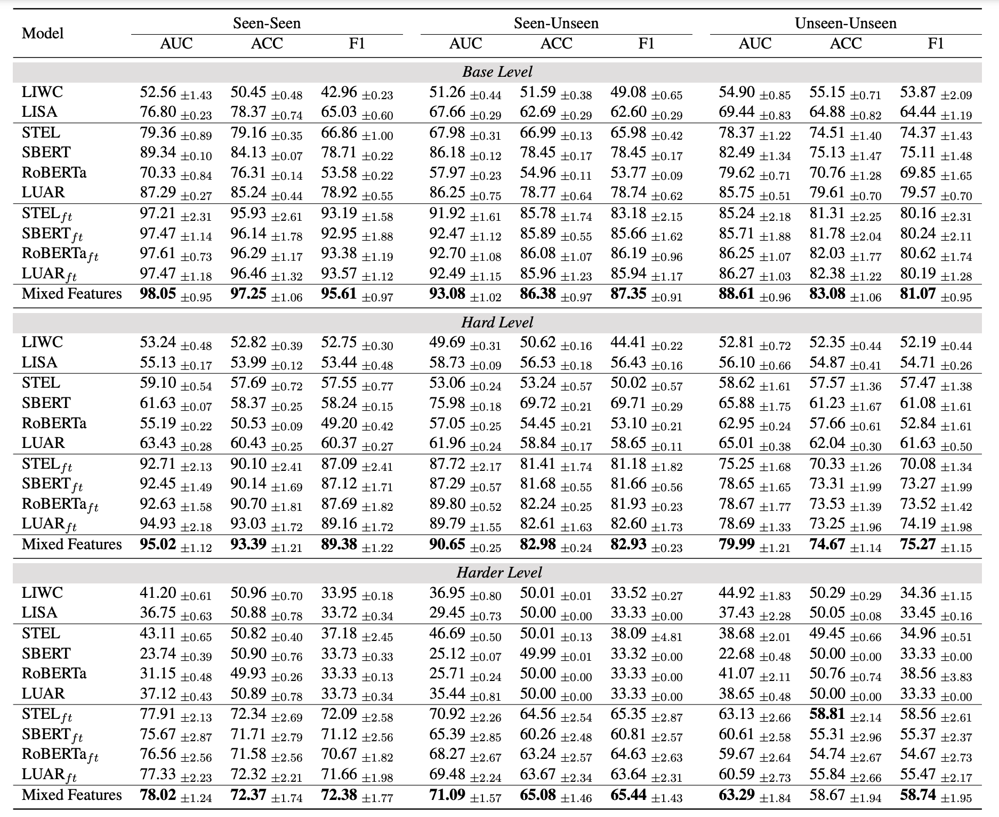

# AGCSpeakerVerification
The official data and code of paper "Speaker Verification in Agent-generated Conversations"

This repository is the official implementation of [Speaker Verification in Agent-generated Conversations](https://aclanthology.org/2024.acl-long.307/).

## Introduction

**[Speaker Verification in Agent-generated Conversations](https://aclanthology.org/2024.acl-long.307/)** 
</br>
Yizhe Yang<sup>1</sup>,
Palakorn Achananuparp<sup>2</sup>,
Heyan Huang<sup>1</sup>,
Jing Jiang<sup>2</sup>,
Ee-Peng Lim<sup>2</sup>

<sup>1</sup> Beijing Institute of Technology, <sup>2</sup> Singapore Management University

> The recent success of large language models (LLMs) has attracted widespread interest to develop role-playing conversational agents personalized to the characteristics and styles of different speakers to enhance their abilities to perform both general and special purpose dialogue tasks. However, the ability to personalize the generated utterances to speakers, whether conducted by human or LLM, has not been well studied. To bridge this gap, our study introduces a novel evaluation challenge: speaker verification in agent-generated conversations, which aimed to verify whether two sets of utterances originate from the same speaker. To this end, we assemble a large dataset collection encompassing thousands of speakers and their utterances. We also develop and evaluate speaker verification models under experiment setups. We further utilize the speaker verification models to evaluate the personalization abilities of LLM-based role-playing models. Comprehensive experiments suggest that the current role-playing models fail in accurately mimicking speakers, primarily due to their inherent linguistic characteristics.

## Speaker Verification Models

### Prepare Dataset

Due to our collection of data from various sources, and considering the open protocol of data sources, we do not release our processed data. However, we do provide the code for processing the data and the download links for the different datasets.

- [Cornell Movie Dialogues](https://www.kaggle.com/datasets/rajathmc/cornell-moviedialog-corpus)

- [Friends](https://github.com/emorynlp/character-mining?tab=readme-ov-file)

- [Harry Potter (Movie)](https://www.kaggle.com/datasets/maricinnamon/harry-potter-movies-dataset) and [HarryPotter (Fiction)](https://nuochenpku.github.io/HPD.github.io/)

- [The Big Bang Theory Series](https://www.kaggle.com/datasets/mitramir5/the-big-bang-theory-series-transcript)

- [Multiple Sessions Conversation](https://parl.ai/projects/msc)

- [AnnoMI](https://github.com/uccollab/AnnoMI)

All downloaded datasets should be placed in the specified folder. Subsequently, run the processing program as follows:

```bash
cd data
python process.py
```

This command navigates to the `data` folder and synthesizes the training and testing datasets. The structure of your processed data should resemble that found in `data/output/example.jsonl`.

### Prepare Models

#### Human & LLM

The detailed instructions for humans and the prompts for the large language model are provided in the paper.

#### Style-Based Models

The style-based models, including LIWC and LISA, are not open-sourced. Therefore, researchers should contact the developers directly.

#### Authorship Attribution Models

The authorship attribution models are available for download via the links provided below. Please follow the instructions on the corresponding websites to download and utilize the models.

- [RoBERTa](https://huggingface.co/FacebookAI/roberta-large)
- [SBERT](https://huggingface.co/sentence-transformers/all-mpnet-base-v2)
- [STEL](https://huggingface.co/AnnaWegmann/Style-Embedding)
- [LUAR](https://huggingface.co/rrivera1849/LUAR-CRUD)

The `src/models.py` file contains the fine-tuned model class, which inherits from the pretrained models.

### Fine Tune

To fine-tune models, run the processing program as follows:

```bash
python src/train.py
    --model name_of_model
    --pretrained_path pretrained_model_path
    --model_save_path save_model_path
    --train_dataset train_dataset_path
    --dev_dataset dev_dataset_path
    --train
```

### Inference

For inference using either pretrained or fine-tuned models, execute the processing program with this command:

```bash
python src/inference.py
    --model name_of_model
    --pretrained_path pretrained_or_fine_tuned_model_path
    --test_dataset test_dataset_path
    --output_path output_result_path
```

### Results

The evaluation results of previous models are shown:



Refer to our [paper](https://aclanthology.org/2024.acl-long.307/) for the complete evaluation results.

## Role-Playing Agent Evaluation

We can employ speaker verification models to assess conversations generated by the role-playing agent. We implement two metrics to evaluate the effectiveness of these models.

### Simulation Score

Simulation Score concentrates on the fidelity of simulation, measuring the similarity between the real utterances and the agentgenerated utterances for the same speaker (or role). This metric measures how well an agent replicates the distinctive style and persona of the characters in the utterances.

The Simulation Score is derived by assessing the similarity between the actual utterances of a speaker and those generated by an agent assuming the same speaker. This involves computing the cosine similarity between encoded representations of the real and generated utterances, facilitated by our speaker verification models.

The following equation presents the formula for calculating the Simulation Score for model $m$.

$$
Sim(m)=\frac{1}{R}\sum_{r=0}^{R}\frac{1}{N_r}\sum_{i=0}^{N_r}\cos(U^r_m, G_i^r)
$$

where $U_m^r$ represents embeddings of the utterances generated by model $m$ when simulating the role $r$, whereas $G^r_i$ denotes embeddings of the utterances corresponding to role $r$ in real conversations $i$. The $R$ denotes the number of roles and $N_r$ denotes the number of real utterances for role $r$.

#### Prepara Data

We should gather the generated utterances of agents and pair them with the real utterances of corresponding roles, as illustrated in `data/simulation.jsonl`. To improve the robustness of our evaluation, it's important to include all real utterances associated with each role in the assessment.

#### Compute Score

We use the MixFeatures model to compute the simulation score.

```bash
python src/inference.py
    --model MixFeature
    --RoBERTa_pretrained_path fine_tuned_RoBERTa_path
    --SBERT_pretrained_path fine_tuned_SBERT_path
    --STEL_pretrained_path fine_tuned_STEL_path
    --LUAR_pretrained_path fine_tuned_LUAR_path
    --test_dataset data/simulation.jsonl
    --output_path output_result_path
```

### Distinction Score

Distinction Score measures how dissimilar the agentgenerated utterances are for different roles. A high distinction score suggests that the agent is proficient in generating utterances of styles of diverse characters. 

The Distinction Score quantifies the ability of an agent to differentiate between the speaker it simulates. For instance, if role-playing agent generates utterances for both Harry Potter and Sheldon Cooper, we measure the dissimilarity (1 minus the cosine
similarity) between two sets of generated utterances using the speaker verification models. A lower similarity score indicates a higher distinction between the speakers, reflecting the agent’s capacity to adjust its linguistic style according to the speaker it is emulating

Following equation presents the formula for calculating the Distinction Score for model $m$.

$$
Dist_r(m)=\frac{1}{R-1}\sum^R_{r'=0,r'\neq r} 1-\cos(U_m^r, U_m^{r'})\\
Dist(m) = \frac{1}{R}\sum_{r=0}^R Dist_r(m)
$$

where, $U_m^r$ and $U_m^{r'}$ represent embeddings of the utterances generated by the same model $m$ when simulating different roles $r$ and $r'$ respectively. For each role $r$, we compare it with all other roles $r'$ while excluding the counterpart within the same conversation.

#### Prepara Data

We should gather the generated utterances of agents for different roles, as illustrated in `data/distinction.jsonl`. To improve the robustness of our evaluation, it's important to include all generated utterances associated with other simulated roles in the assessment.

#### Compute Score

We use the MixFeatures model to compute the distinction score.

```bash
python src/inference.py
    --model MixFeature
    --RoBERTa_pretrained_path fine_tuned_RoBERTa_path
    --SBERT_pretrained_path fine_tuned_SBERT_path
    --STEL_pretrained_path fine_tuned_STEL_path
    --LUAR_pretrained_path fine_tuned_LUAR_path
    --test_dataset data/distinction.jsonl
    --output_path output_result_path
```

## Further Discussion

While fine-tuning with a specific dataset can markedly improve performance, even for unseen users and their conversations, the accuracy remains to be less than ideal. There is therefore considerable room to improve the verification accuracy, such as incorporating the utterances of other interlocutors, modeling the interaction as well as leveraging insights of linguistic accommodation. For evaluation purposes, we recommend that researchers construct a limited set of role-specific utterances to fine-tune the models.

Current evaluation model predicts a single similarity score for a pair of utterance sets, broadly reflecting their degree of similarity (or difference). This score captures a range of dimensions, including linguistic style, persona traits, and personal background. However, this single score value lacks interpretability that allows it to be mapped to similarity (difference) score in different fine-grained personal dimensions.

Looking ahead, our focus will be on developing interpretable, fine-grained, and robust speaker verification models that provide more detailed insights into the similarities and differences between speakers.

## BibTeX

```
@inproceedings{yang-etal-2024-speaker,
    title = "Speaker Verification in Agent-generated Conversations",
    author = "Yang, Yizhe  and
      Achananuparp, Palakorn  and
      Huang, Heyan  and
      Jiang, Jing  and
      Lim, Ee-Peng",
    booktitle = "Proceedings of the 62nd Annual Meeting of the Association for Computational Linguistics (Volume 1: Long Papers)",
    month = aug,
    year = "2024",
    address = "Bangkok, Thailand",
    publisher = "Association for Computational Linguistics",
    url = "https://aclanthology.org/2024.acl-long.307",
    pages = "5655--5676"
}
```

## License

This project is released under the Apache 2.0 [license](./LICENSE).


